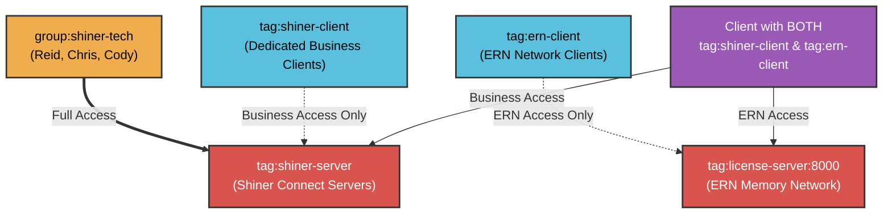

# Shiner Network Access Map

This map visually breaks down how the tags and groups isolate access across your Tailscale network.

## Network Topology

## Summary of Permissions

| Role / Tag | Description | Network Access |
|---|---|---|
| **`group:shiner-tech`** | Admin/Tech team (Reid, Chris, Cody) | Full access to `shiner-server` instances. |
| **`tag:shiner-client`** | Isolated clients (e.g. campground-office) | **ONLY** allowed to talk to `shiner-server`. Completely blocked from seeing other clients or your personal admin devices. |
| **`tag:ern-client`** | ERN-specific clients | **ONLY** allowed to talk to the ERN network on port 8000. |
| **Both Client Tags** | A device assigned both of the above tags | Gets additive access to **both** `shiner-server` and the ERN network, but remains isolated from everything else. |
